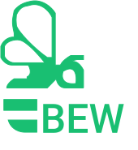

<h1 align="center">Business Enterprise Webshop</h1>

Business Enterprise Webshop (BEW) é um sistema de gerenciamento de vendas desenvolvido para a matéria de Laboratório de Programação Web I.

  <a href="#sobre">Sobre</a> •
  <a href="#tecnologias">Tecnologias</a> •
  <a href="#licenca">Licença</a> •
  <a href="#layout">Layout</a> •
  <a href="#funcionalidades">Funcionalidades</a> •
  <a href="#autores">Autores</a>

<h2 id="tecnologias">Tecnologias</h2>

As seguintes ferramentas estão sendo utilizadas na construção do projeto:

<h2 id="licenca">Licença</h2>

Este projeto está sob licença do MIT que permite a qualquer pessoa que obtém uma cópia do software e seus arquivos de documentação associados poder lidar com eles sem restrição ou limitação aos direitos de uso. As condições impostas são de apenas manter o aviso de copyright e uma cópia da <a href="https://github.com/ProjetosCMS/BEW/blob/main/LICENSE">licença</a> em todas as reproduções do software.

<h2 id="layout">Layout</h2>

- Login

- Dashboard

Acesse o layout completo no [Figma](https://www.figma.com/file/VLJiXLRJlLLLioYwbZtI95/BEW?node-id=0%3A1) (ainda em construção).

<h2 id="funcionalidades">Funcionalidades</h2>

- [X] Login
- [X] Dashboard
- [X] Adição e consulta de vendas
- [ ] Edição de vendas
- [ ] Adição, consulta e edição de compras
- [X] Adição, consulta, edição e remoção de produtos
- [X] Adição, consulta, edição e remoção de fornecedores
- [X] Adição, consulta, edição e remoção de funcionários
- [X] Adição, consulta, edição e remoção de clientes
- [ ] Adição, consulta, edição e remoção de promoções
- [X] Adição, consulta, edição e remoção de categorias
- [ ] Gerenciamento de relatórios

<h3>Visualizar versão de produção</h3>

- User: convidado
- Senha: Convidado@123

acesse este link: [bew.com.br](http://bew-web.herokuapp.com/login) e insira suas credenciais.

<h2 id="autores">Autores</h2>

<table align="center">
    <tr>
        <td align="center">
            <a href="https://github.com/claudiohenriquefds">
                
                 
                <b>Cláudio Henrique</b>
            </a>
        </td>
        <td align="center">
            <a href="https://github.com/marciosamuel">
                
                 
                <b>Marcio Samuel</b>
            </a>
        </td>
        <td align="center">
            <a href="https://github.com/mateusgs29">
                
                 
                <b>Mateus Gomes</b>
            </a>
        </td>
    </tr>
</table>
